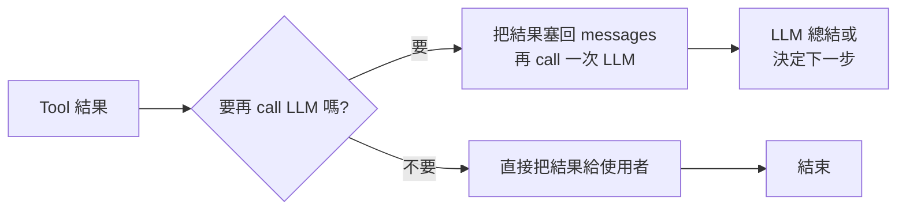
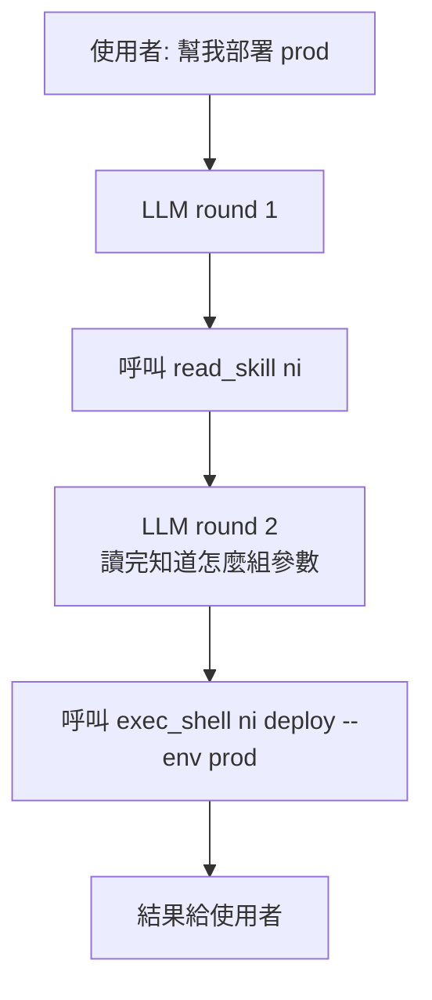

# Agent Loop 策略：為什麼有的 tool 要多輪、有的要單輪

> 一句話摘要：LLM 呼叫工具後要不要再 call 一次 LLM，是延遲與能力的取捨。這份筆記解釋這個專案是怎麼決定的。

## 先說結論

- **讀資料的工具**（`read_skill`、`web_fetch`）→ 拿到結果後**再 call LLM**，讓它決定下一步。
- **執行動作的工具**（`exec_shell`）→ 拿到結果後**直接給使用者**，不再 call LLM（節省時間與成本）。
- 整個互動最多 5 輪 LLM，避免失控。

---

## 從一個日常情境開始

假設你請一個助理幫你「訂明天的日本料理餐廳」。他有兩種做法：

**做法 A（直接行動）**
- 助理自己決定：打電話訂一家他記得的店
- 訂完就把結果告訴你：「訂到了，7 點 XX 壽司」
- 快，但也許不是你最想要的

**做法 B（先研究再行動）**
- 先查評價、看位置、比價格
- 根據這些資料判斷哪家最合適
- 最後才訂，再回報結果
- 慢，但結果品質高

這就是 Agent loop 的核心問題：**一個工具用完，要不要回去想想再做下一步？**

---

## 技術背景

LLM 呼叫工具（tool calling）的基本流程：

```
使用者訊息 → LLM → (決定要用什麼工具) → 執行工具 → 拿到結果 → ???
```

最後那個 `???` 有兩條路：



每次 call LLM：
- 時間：1~3 秒
- 金錢：input + output token
- 等待體驗：TG 畫面的 typing 指示器

所以選哪條路**直接影響使用者的等待時間**。

---

## Option A vs Option B

### Option A — 執行完就停

```
使用者：列出這台機器裝了什麼
LLM: (決定) 呼叫 exec_shell("ls /usr/local/bin")
→ 執行
→ 結果直接 echo 給使用者
完成。共 1 次 LLM call。
```

**適合**：使用者想看「原始資料」的場景。像 shell 輸出、檔案內容，LLM 翻譯反而是噪音。

### Option B — 每次執行完再 call LLM

```
使用者：列出這台機器裝了什麼
LLM: 呼叫 exec_shell("ls /usr/local/bin")
→ 執行
→ 結果塞回 messages
→ LLM 第二次回覆：「你這台機器裝了 node、git、holeOpen... 看起來是開發機」
完成。共 2 次 LLM call。
```

**適合**：使用者要的是「解讀」、「摘要」、「判斷」，raw data 對他沒意義。

---

## 但 Skill 天生就是多輪的

Skills 採用**漸進揭露**（progressive disclosure）：

- system prompt 只放 skill 的「一行描述」（便宜、省 token）
- 詳細內容要 LLM 呼叫 `read_skill(name)` 才拿得到

問題來了：`read_skill` 拿到的只是「說明書」，**不是最終答案**。LLM 讀完說明書後還要：
1. 判斷該用哪個指令
2. 組出正確的參數
3. 再呼叫 `exec_shell` 真的執行

這整段流程**一定要多輪**，不然 LLM 還沒看完說明書就被迫中止。



所以同一個 agent 裡：
- 有些 tool 需要多輪（像 `read_skill`）
- 有些 tool 希望單輪就結束（像 `exec_shell`）

---

## 解法：依「工具性質」分類，不是依「skill」

我們把工具分兩類：

| 類別 | 工具 | 特性 | 呼叫後行為 |
|------|------|------|-----------|
| 讀取類 | `read_skill`、`web_fetch` | 拿資料，沒有副作用 | 結果塞回 messages，**繼續下一輪 LLM** |
| 執行類 | `exec_shell` | 會動到系統、使用者要的是輸出本身 | 結果直接給使用者，**立刻終止** |

這樣的好處：

1. **純聊天**：1 次 LLM，無工具 → 最快
2. **執行單一指令**（「列資料夾」、「重啟服務」）：1 次 LLM + 1 次 exec_shell → 快
3. **研究任務**（「幫我看 XX 網站怎麼說」）：N 次 web_fetch + 最後回一段文字 → 自動多輪
4. **用 skill 部署**：read_skill + exec_shell，恰好 2 次 LLM → 可接受
5. **研究 + 執行混合**：多次 web_fetch → 最後 exec_shell 終止 → 自然

### 為什麼不用 Option B 全多輪？

Option B 的代價是：每個 shell 指令都會被 LLM 多轉一次。對 90% 的「遠端跑指令」場景來說：

- 你打「看磁碟空間」→ 你**就是想看那個表格**
- Option B 會給你：「你的磁碟用了 73%，主要被 node_modules 吃掉...」
- 速度慢 3 秒、token 多花一次、回覆還可能漏細節

所以執行類工具走 Option A 更符合使用者直覺。

---

## 無限迴圈怎麼辦？

每次 LLM 都可能決定「再抓一個網頁」、「再讀一個 skill」。理論上能跑到天荒地老。

**保險絲：`MAX_ROUNDS = 5` + 強制總結**

- 超過 5 輪不直接中斷，而是**再 call 一次 LLM 強制總結**：把 `tool_choice: 'none'` 加進 system 訊息「禁止再呼叫工具，用現有資料回覆」，把 LLM 逼回文字路徑
- 回覆前綴 `⚠️ 已達互動上限...` 讓使用者知道這是 best-effort 結果
- 避免出現「抓了 9 個網頁，最後一個字都沒寫就中斷」的浪費
- System prompt 還會**提前告訴 LLM 有幾輪預算**，要它在 2~3 個來源後就產出，減少撞上限的機率

---

## 常見誤解

**誤解 1：多輪一定比單輪好，因為 LLM 可以思考。**
錯。使用者想看 `ls` 的原始輸出時，LLM 的「思考」是噪音。

**誤解 2：Option A 犧牲品質。**
不是，Option A **只在執行類工具**後跳過 LLM 總結。純聊天、讀取類工具都還是會 call LLM。品質犧牲只發生在「使用者本來就想看原始輸出」的情境，那本來就不需要 LLM 美化。

**誤解 3：skill 必須用某種特別的多輪模式。**
不用。只要 skill 的「讀取說明」用讀取類工具（`read_skill`）、「執行」用執行類工具（`exec_shell`），既有的分類自動 cover。

---

## 延伸思考

1. **web_fetch 如果回的網頁很大怎麼辦？** 目前截斷到 8000 字，LLM 可能漏關鍵資訊。未來可加「fetch 後自動摘要」層，但這又多一次 LLM call，又回到權衡。
2. **exec_shell 能不能也走多輪，但由 LLM 主動決定？** 可以讓 LLM 用「tool_choice: none」在最後一輪做總結。這樣第一次 exec_shell 不終止，但下一輪 LLM 不能再呼叫工具、只能回文字。程式複雜度顯著上升，先不做。
3. **如果有一個 skill 真的需要「exec → 判斷 → exec」呢？** 例如先 `git status` 再根據輸出決定要不要 `git stash`。目前做法是寫成一行 shell 鏈（`git status && ... && git stash`），或把邏輯包進 CLI（讓 `ni` 自己判斷）。硬要在 LLM 層做，就要改成 Option B。

---

## 這個專案目前的決策

```
讀取類 (read_skill, web_fetch) → 多輪
執行類 (exec_shell)           → 單輪終止
MAX_ROUNDS = 5
```

實作位置：`src/agent/index.js`，在 handleReadSkill / handleWebFetch / handleExecShell 三個函式裡分別處理。

如果未來新增工具，依這個表判斷歸哪一類、照既有 pattern 實作即可。
